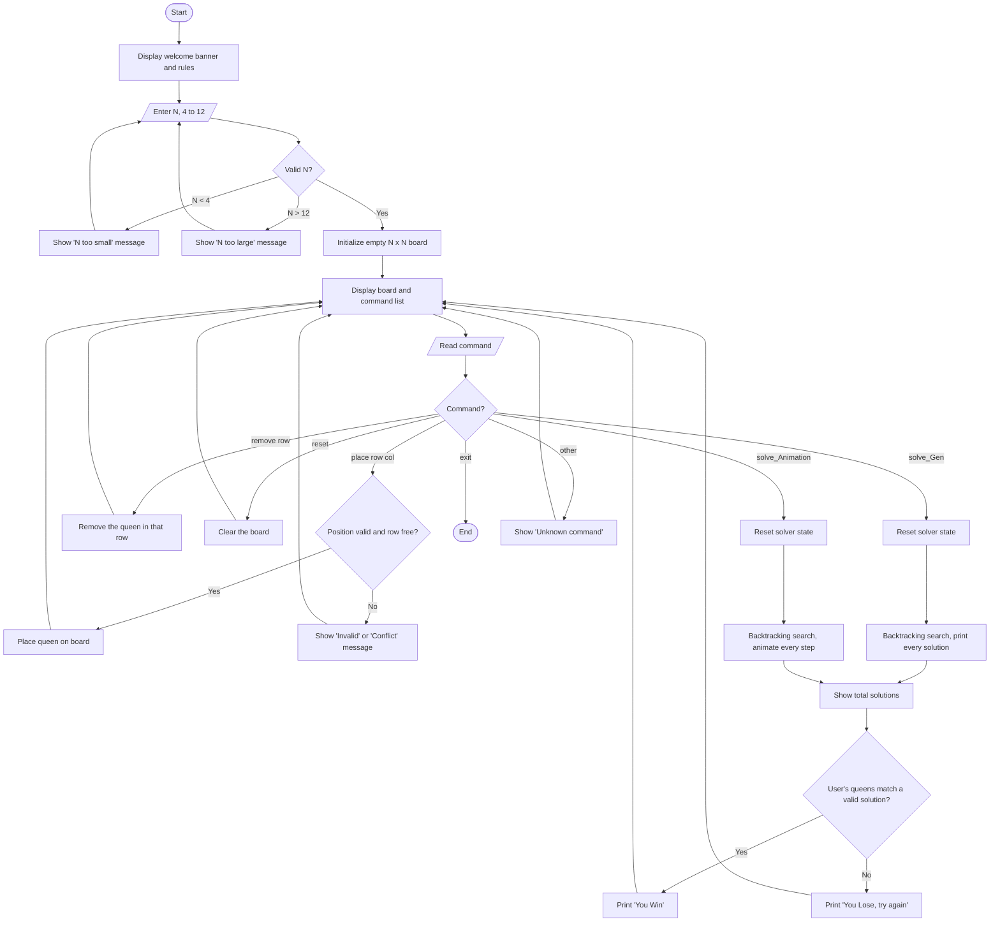

# ♛ Interactive N-Queens Solver (C++)


-orange)

An interactive, console-based **N-Queens puzzle game and solver** written in C++.
Play the puzzle manually, then let the program verify your answer, animate the search, or enumerate every valid solution using a **Backtracking algorithm**.

<table>
  <tr>
    <td align="center">
      <a href="https://postimg.cc/d76KRkbq"></a><br>
      <sub>Console gameplay</sub>
    </td>
    <td align="center">
      <pre>
Q . . . . . . .
. . . . Q . . .
. . . . . . . Q
. . . . . Q . .
. . Q . . . . .
. . . . . . Q .
. Q . . . . . .
. . . Q . . . .
</pre>
      <sub>8×8 board: a valid solution (console output)</sub>
    </td>
  </tr>
</table>

---

## 🎬 Demo Video

▶️ **[Watch the full project demo](https://drive.google.com/file/d/1SvG6ANOCwqtG-vPYF8ch6C_Kqd8t-GzM/view?usp=sharing)**

---

##  Table of Contents

1. [Overview](#overview)
2. [Features](#features)
3. [Game Rules](#game-rules)
4. [Algorithm: Backtracking](#algorithm-backtracking)
5. [Application Flow](#application-flow)
6. [Function Architecture](#-function-architecture)
7. [Commands](#commands-interactive-mode)
8. [Getting Started](#getting-started)
9. [Example Session](#example-session)
10. [Known Solution Counts](#known-solution-counts)
11. [Limitations & Future Improvements](#limitations--future-improvements)

---

##  Overview

The N-Queens problem is a classic algorithmic challenge: place **N queens** on an **N×N chessboard** so that no two queens attack each other.

This project provides:

- An interactive gameplay mode where you place and remove queens yourself
- A full **Backtracking** solver that searches the entire solution space
- An animated, step-by-step visualization of the search
- A generator that prints every valid solution and counts them
- Automatic Win/Lose detection based on your own board

---

##  Features

| Feature | Description |
|---|---|
| Interactive board | Console chessboard (N from 4 to 12) redrawn after every command |
| Manual play | Place and remove queens with simple text commands |
| Input validation | Rejects out-of-range positions and a second queen in the same row |
| **Backtracking solver** | Recursive search that explores, validates, and undoes placements |
| Animated solver | `solve_Animation` shows each placement and backtrack step (200 ms/frame) |
| Solution generator | `solve_Gen` prints all valid boards instantly, without animation |
| Solution counter | Reports the total number of valid solutions for the chosen N |
| Win / Lose detection | Checks whether your queens match a valid solution |

---

##  Game Rules

- Place exactly **N queens** on an **N×N** board.
- Each row must contain exactly **one** queen.
- Each column must contain exactly **one** queen.
- No two queens may share a **diagonal** (both directions).
- The goal is a configuration in which no queen can attack another.

A queen attacks along its **row**, **column**, and both **diagonals**.

---

##  Algorithm: Backtracking

> **This project is built on the Backtracking algorithm (recursive depth-first search).**

Backtracking builds a solution incrementally, one row at a time. When a partial placement cannot lead to a valid solution, it **undoes the last move** and tries the next option.

**How it works in this project**

1. Start at row 1.
2. For the current row, try each column that is not already used (tracked in the `queen[]` array).
3. **Place** a queen: mark the column, write `Q` on the grid, store the position in `pos`.
4. **Recurse** into the next row.
5. When all N rows are filled, **validate the diagonals** by comparing every pair of queens (`|Δrow| == |Δcol|` means a conflict).
6. If the board is valid, count it, check it against the user's board, and print it.
7. **Backtrack**: remove the queen, unmark the column, and try the next column.

```text
solve(row):
    if row > N:
        if no two queens share a diagonal:
            totalSolutions++ ; record / display the board
        return
    for col in 1..N:
        if column col is used: continue
        place queen at (row, col)          # choose
        solve(row + 1)                     # explore
        remove queen from (row, col)       # un-choose (backtrack)
```

| Concept | Implementation |
|---|---|
| Recursion (DFS) | `solve_Gen(row)` and `solve_Animation(row)` |
| Row constraint | One queen per recursion level |
| Column constraint | `bool queen[]` array |
| Diagonal constraint | Pairwise check `abs(r1 - r2) == abs(c1 - c2)` at the base case |
| State tracking | `vector<pair<int,int>> pos` and the `grid` matrix |
| Search space | Complete search, **O(N!)** |

---

##  Application Flow

### Runtime flow



### Step-by-step

1. **Launch**: the program prints the title, the rules, and the available commands.
2. **Choose N**: the input is validated in a loop. Values below 4 have no solutions, and values above 12 are rejected to avoid very long runtimes (O(N!)).
3. **Play**: the board is drawn, and you enter commands (`place`, `remove`, `reset`).
4. **Solve / Verify**: run `solve_Animation` or `solve_Gen`. The solver resets its state, runs the backtracking search, and counts every valid solution.
5. **Result**: the program compares your queens against the valid solutions and prints **You Win** or **You Lose**, together with the total solution count.
6. **Continue or exit**: return to the board to try again, or type `exit`.

### Program flow diagram

[](https://postimg.cc/1VBL1LK6)

---

##  Function Architecture

[](https://postimg.cc/Yvvq83pQ)

| Function | Role |
|---|---|
| `main()` | Prints the banner, validates N, starts interactive mode |
| `interactiveMode()` | Main command loop: parses and dispatches user commands |
| `displayBoard()` | Draws the user's board |
| `isSafe(row, col)` | Validates a manual placement (one queen per row) |
| `solve_Gen(row)` | Backtracking solver that prints all solutions (no animation) |
| `solve_Animation(row)` | Backtracking solver that animates every step |
| `displayGridAnimated()` | Draws the solver's board and pauses for 200 ms |

---

##  Commands (Interactive Mode)

| Command | Description |
|---|---|
| `place <row> <col>` | Place a queen at the given position (1-indexed) |
| `remove <row>` | Remove the queen from the given row |
| `reset` | Clear the whole board |
| `solve_Animation` | Run the backtracking solver with a step-by-step animation and check your board |
| `solve_Gen` | Generate and print all valid solutions, then check your board |
| `exit` | Quit the program |

---

##  Getting Started

### Requirements

- A C++ compiler with C++11 or later (GCC, Clang, or MinGW)
- Windows terminal recommended (uses `cls` and `pause`)

### Build and run

```bash
g++ -std=c++17 -O2 main.cpp -o nqueens
./nqueens        # on Windows: nqueens.exe
```

> **Linux / macOS:** replace `system("cls")` with `system("clear")`, and remove or replace `system("pause")`, since these are Windows commands.

---

##  Example Session

```text
============================================
N-Queens Puzzle
============================================
Enter N: Size of chessboard for N-Queens Puzzle (4 to 12): 4
Great! You chose N = 4. Let's play!

. . . .
. . . .
. . . .
. . . .

Commands: place row col | remove row | solve_Animation | solve_Gen | reset | exit
Enter command: place 1 2
```

A valid 4×4 solution looks like this:

```text
. Q . .
. . . Q
Q . . .
. . Q .
```

---

##  Known Solution Counts

| N | 4 | 5 | 6 | 7 | 8 | 9 | 10 | 11 | 12 |
|---|---|---|---|---|---|---|---|---|---|
| Solutions | 2 | 10 | 4 | 40 | 92 | 352 | 724 | 2,680 | 14,200 |

Use these values to verify the counter printed by the solver.

---

##  Limitations & Future Improvements

- Manual placement currently validates **rows only**; column and diagonal conflicts are resolved by the solver.
- Diagonal checks happen at the end of each full placement. Pruning diagonals **during** recursion would cut the search dramatically.
- Add a cross-platform helper for clearing the screen on Linux/macOS.
- Add a hint command that suggests the next safe queen.
- Optional: bitmask-based solver for larger N.

---

##  Author

Developed as a C++ practice project on recursion, backtracking, and console UI design.
